# Gestão-Pet: Sistema de Acompanhamento Veterinário
## Problema abordado e justificativa
Em Fortaleza, o registro de animais atendidos pela rede pública de veterinária é restrito a servidores, impedindo que tutores acompanhem o histórico de saúde de seus pets. Isso gera falta de transparência e dificulta o cuidado contínuo. A solução visa democratizar o acesso às informações veterinárias, alinhando-se ao ODS 11 ao promover cidades mais inclusivas e sustentáveis.

## Integrantes da equipe e papéis

- Caio Henrique Felix da Silveira: Desenvolvimento Backend. Matrícula: 2326320
- Emmanuel de Oliveira e Silva: Desenvolvimento Mobile. Matrícula: 2325882
- Layza Larissa dos Santos: UX/UI e Documentação. Matrícula: 2326311
- Thiago da Silva Tavares: Desenvolvimento Web. Matrícula: 2326278
- Vinicius Gabriel da Justa Ximenes: Gerente de Projeto e Testes. Matrícula: 2326167
- William Julian Lemos de Holanda: Arquitetura e Banco de Dados. Matrícula: 2314705

## Acesso ao sistema

Para executar o projeto:
## 1. Instale a versão estável mais recente do Node.js.
## 2. Após verificar que o npm foi instalado, execute 'npm install expo' no terminal do git bash dentro do repositório do projeto.
## 3. Execute 'npx expo start' para iniciar o servidor do expo e você conseguirá acessar a aplicação pelo navegador e pelo celular.

### ATENÇÃO -> Para o app funcionar no seu celular ao escanear o qrCode que vai aparecer no terminal após iniciar o servidor Expo, você precisa manter a versão do Parse em 4.2.0 ###

## Estrutura do projeto
```bash
gestao-pet/
├── README.md
├── docs/
│   ├── requirements/
│   │   └── requirements.md
│   ├── architecture/
│   │   └── architecture.md
│   ├── database/
│   │   └── database_model.md
│   └── api/
│       └── api_specification.md
├── gestao-pet/
│   └──_layout.jsx                 
│   └──index.jsx                   
│   └──signup/                     
│   │   └──index.jsx              
│   │   └──tutor/                      
│   │      └──index.jsx               
│   │      └──animal-details.jsx     
│   │      └── register-animal.jsx    
│   └──employee/                   
│      └── index.jsx              
│      └── register-appointment.jsx 
├── prototypes/
│   ├── web/
│   │   ├── login.html
│   │   ├── cadastro-usuario.html
│   │   ├── meus-pets.html
│   │   ├── cadastro-animal.html
│   │   ├── historico-animal.html
│   │   ├── pesquisa-animal.html
│   │   └── registro-consulta.html
│   └── mobile/
│       ├── login-mobile.html
│       ├── cadastro-usuario-mobile.html
│       ├── meus-pets-mobile.html
│       ├── cadastro-animal-mobile.html
│       ├── perfil-pet-mobile.html
│       ├── pesquisa-animal-mobile.html
│       └── registro-consulta-mobile.html
└── images/
    ├── app-userflow.png
    └── legenda-userflow.png
```

## Objetivos do sistema
- Permitir que tutores visualizem o histórico de consultas, vacinas e procedimentos de seus animais

- Facilitar o registro e a consulta de animais por servidores públicos

- Garantir transparência e acesso fácil às informações de saúde animal

- Reduzir a perda de informações entre consultas veterinárias

- Otimizar o trabalho dos servidores públicos na gestão de atendimentos

## Funcionalidades 
- Cadastro de tutores e servidores
- Registro de animais por servidores
- Associação de animais a tutores
- Consulta de animais e histórico de atendimentos
- Registro de consultas e procedimentos por servidores
- Visualização de histórico completo por tutores

#### Visão geral da arquitetura:
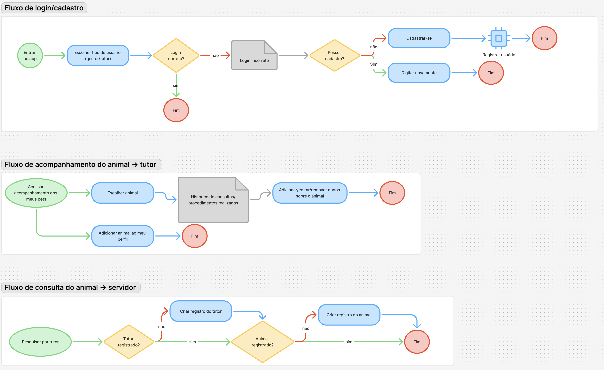

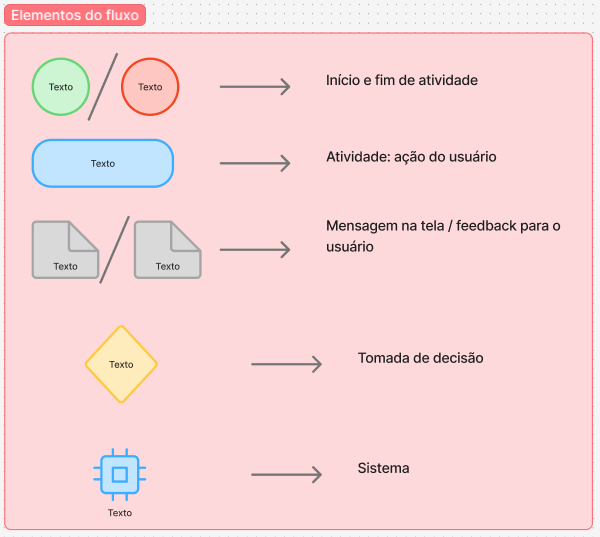  

## Arquitetura Cliente-Servidor com Backend como Serviço (BaaS)
O sistema segue uma arquitetura cliente-servidor com frontend multiplataforma (web e mobile) e backend hospedado no Back4App (BaaS).

**Componentes principais:**

- **Frontend Web:** Aplicação React.js para tutores e servidores
- **Frontend Mobile:** Aplicativo React Native para tutores
- **Backend:** Back4App com APIs REST para gerenciar usuários, animais e consultas
- **Banco de dados:** PostgreSQL gerenciado pelo Back4App

**Fluxos principais:**

1. **Autenticação:** Login diferenciado por tipo de usuário (tutor/servidor)
2. **Fluxo Tutor:** Visualização de animais → Acesso ao histórico → Gestão de dados
3. **Fluxo Servidor:** Pesquisa de animais → Registro de consultas → Cadastro de novos animais

## Protótipos de Interface
### Telas Web
**Tela de Login**
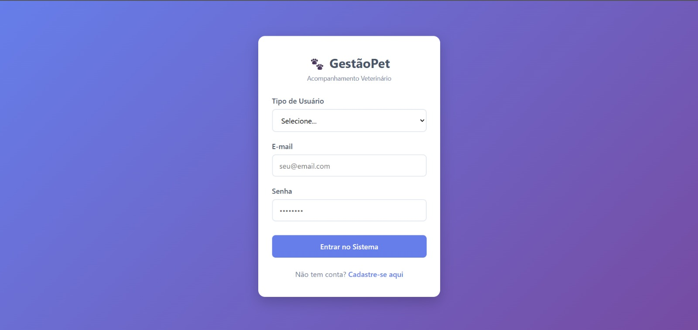

**Tela de Cadastro de Usuário**
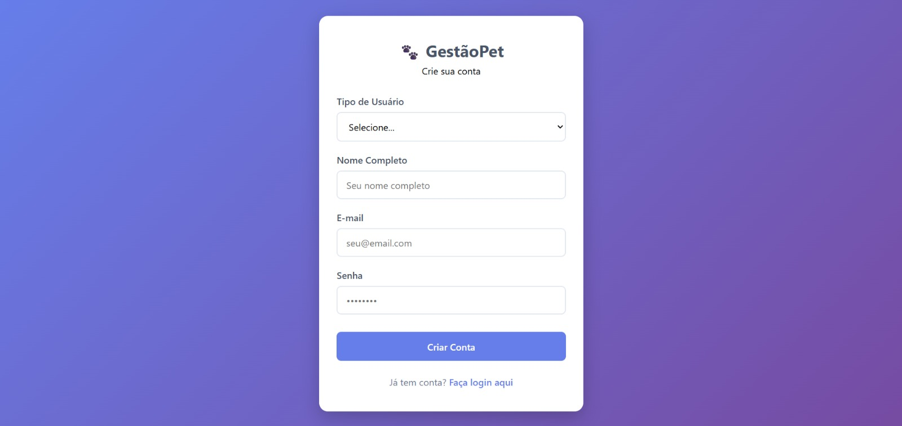

**Tela Meus Pets**
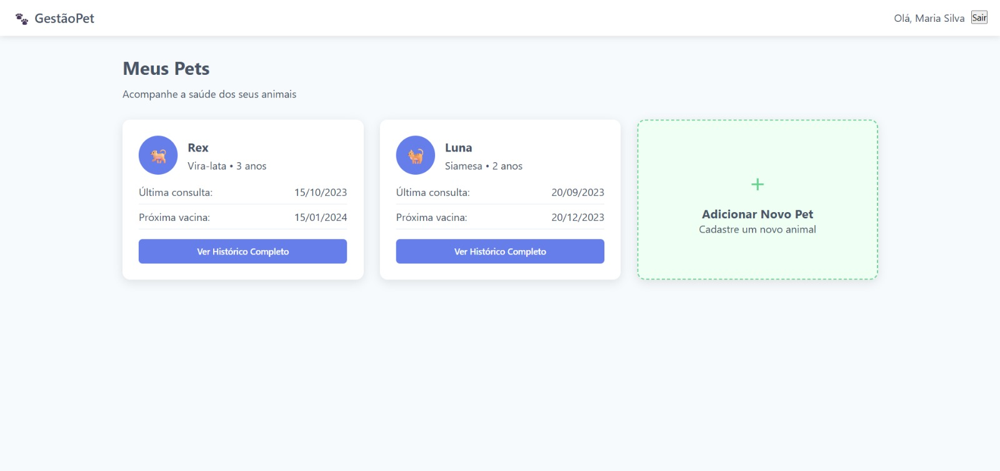

**Tela Cadastro Animal**
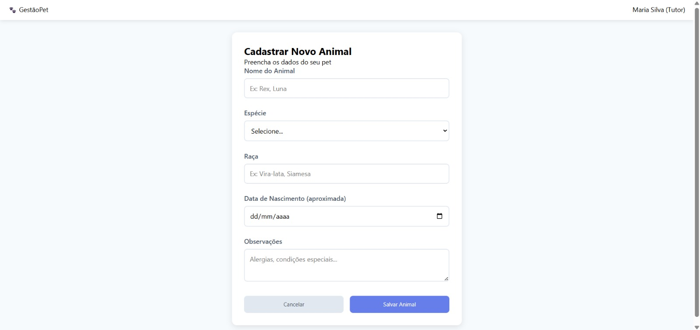

**Tela Pesquisa**
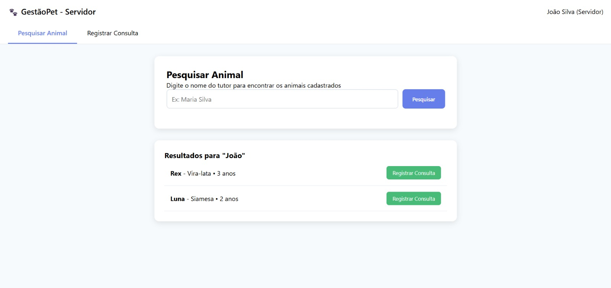

**Tela Histórico**
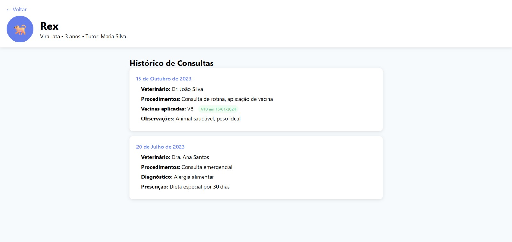

**Tela Registro Consulta**
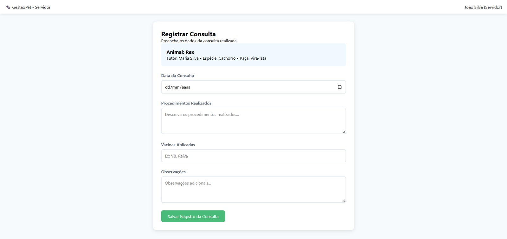


### Telas Mobile
**Tela de Login**

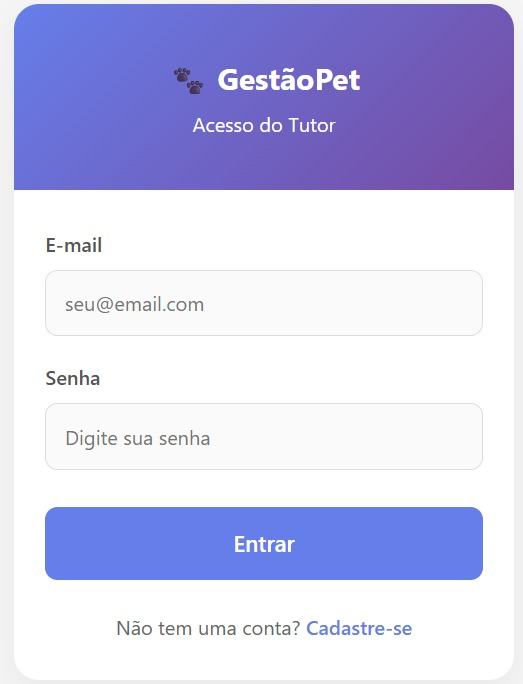

**Tela de Cadastro de Usuário**

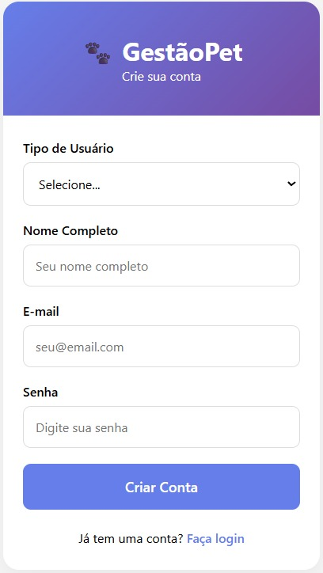

**Tela Meus Pets**

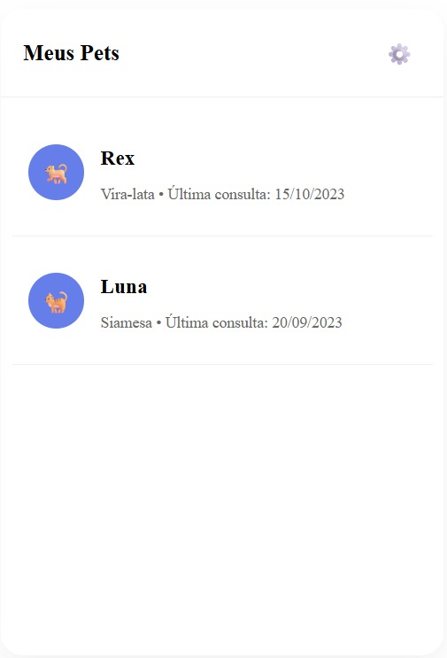

**Tela Cadastro Animal**

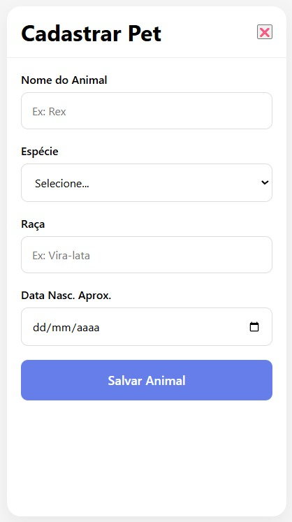

**Tela Perfil Animal**

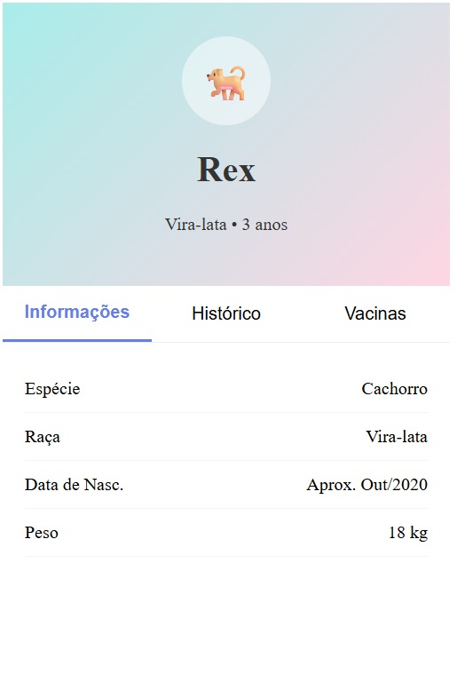

**Tela Histórico**

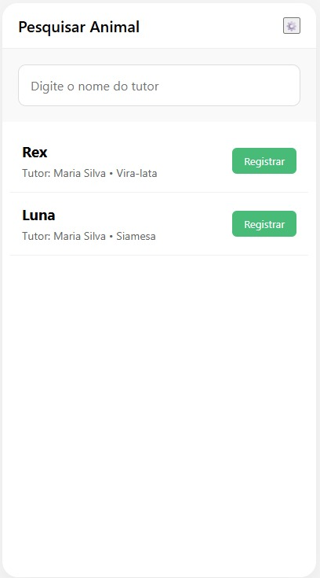

**Tela Registro Consulta**

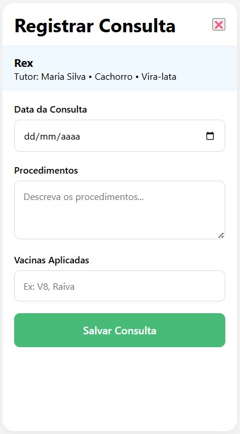

## Tecnologias propostas
### Frontend
- **Web:** JavaScript, React.js, HTML5, CSS3

- **Mobile:** React Native (iOS/Android), Swift (iOS nativo como alternativa)

### Backend
- **Plataforma:** Back4App (Backend as a Service)

- **Banco de dados:** PostgreSQL

- **Autenticação:** JWT (JSON Web Tokens)

- **APIs:** RESTful API

### Ferramentas de desenvolvimento
- **Versionamento:** Git e GitHub

- **Prototipação:** Figma, Draw.io

- **Documentação:** Markdown

- **Testes:** Jest (frontend), Postman (APIs)

### Infraestrutura
- **Hospedagem:** Back4App (backend), Vercel/Netlify (frontend web)

- **Armazenamento:** Back4App Storage

- **Monitoramento:** Logs integrados do Back4App

## Cronograma para Etapa 2 (N708)
### Outubro
**Semana 1 (02/10 - 06/10)** - Planejamento e Setup

- Revisar fluxos e definir MVP final
- Configurar repositórios separados (web e mobile)
- Criar classes no Back4App (User, Animal, Consulta)
- Setup inicial web (frontend) e mobile (React Native/Flutter)
**Semana 2 (09/10 - 13/10)** - Login e Cadastro

- Implementar autenticação no web e mobile
- Diferenciar gestor/tutor via campo role
- Garantir persistência de sessão
- Testes iniciais em navegador e simulador
**Semana 3 (16/10 - 20/10)** - Fluxo Tutor – Parte 1

- Web: adicionar, editar e remover animal
- Mobile: tela "meus pets" e adicionar animal
- Banco: garantir relacionamento Tutor → Animais
- Testes CRUD tutor em ambos
**Semana 4 (23/10 - 27/10)** - Fluxo Tutor – Parte 2

- Web: histórico de consultas e detalhes do animal
- Mobile: detalhes do animal e histórico
- Integração tutor com consultas (versão inicial)

### Novembro 
**Semana 5 (30/10 - 03/11)** - Fluxo Gestor – Parte 1

- Web: implementar pesquisa de animal e permitir criar registro cso não exista

- Mobile: criar tela de pesquisa de animal, com opção de cadastro qando não encontrado

- Banco: ajustar permissões para que o gestor tenha acesso a todos o animais

**Semana 6 (06/11 - 10/11)** - Fluxo Gestor – Parte 2

- Web: implementar registro de consulta vinculada a um animal
- Mobile: criar tela de registro de consulta, salvando dados no Bck4App

- Integração: validar que consultas cadastradas pelo gestor aparecem no histórico do tutor

**Semana 7 (13/11 - 17/11)** - Design e Usabilidade

- Web: ajustar layout, responsividade e experiência de uso
- Mobile: implementar navegação/tab bar e feedback visual (oading, mensagens de erro, confirmações)

- Testes em diferentes navegadores e dispositivos móveis
**Semana 8 (20/11 - 24/11)** - Finalização e Documentação

- Testes ponta a ponta em web e mobile
- Correções finais de bugs
- Revisão de código e organização dos repositórios
- Documentar fluxos, classes e instruções de uso

## Relação com ODS 11 - Cidades e Comunidades Sustentáveis
Este projeto contribui diretamente para o **Objetivo de Desenvolvimento Sustentável 11**, que visa tornar as cidades e os assentamentos humanos inclusivos, seguros, resilientes e sustentáveis.

**Como o Gestão-Pet se alinha ao ODS 11:**

- **Inclusão:** Democratiza o acesso à informação veterinária para todos os cidadãos

- **Saúde urbana:** Melhora o acompanhamento da saúde animal na cidade

- **Transparência:** Promove acesso aberto a informações de serviços públicos

- **Tecnologia sustentável:** Utiliza soluções digitais para otimizar recursos públicos

A solução fortalece a gestão pública veterinária, contribuindo para uma Fortaleza mais sustentável e com melhor qualidade de vida para tutores e seus animais.
