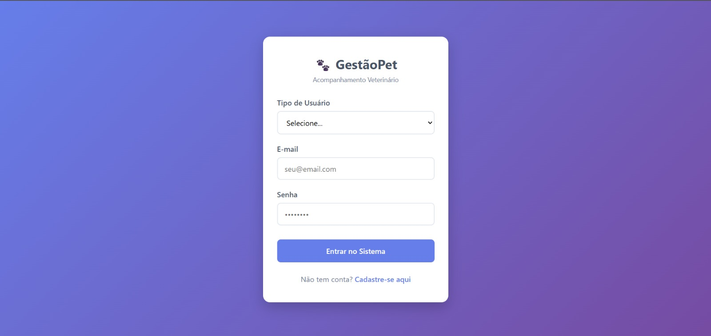
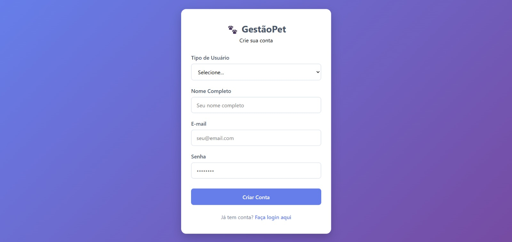
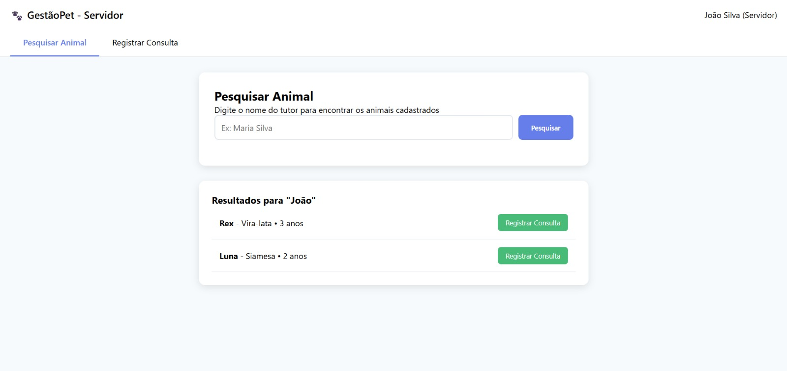
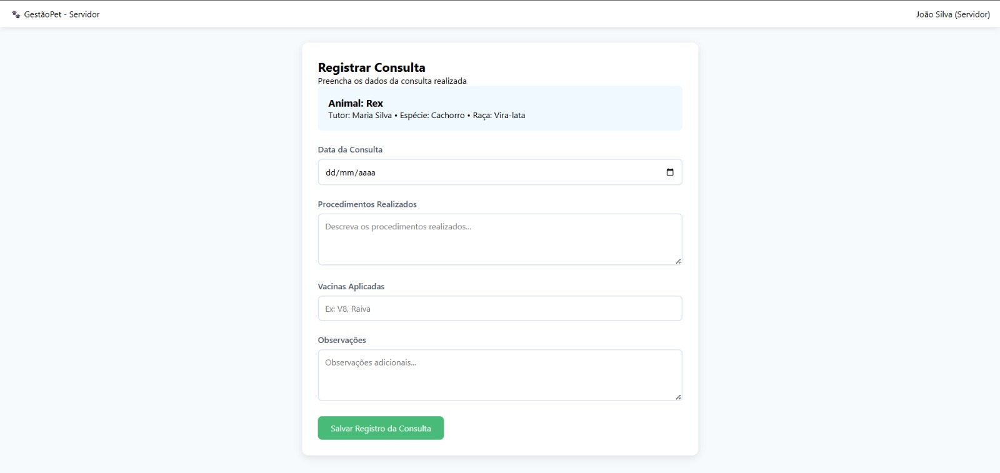
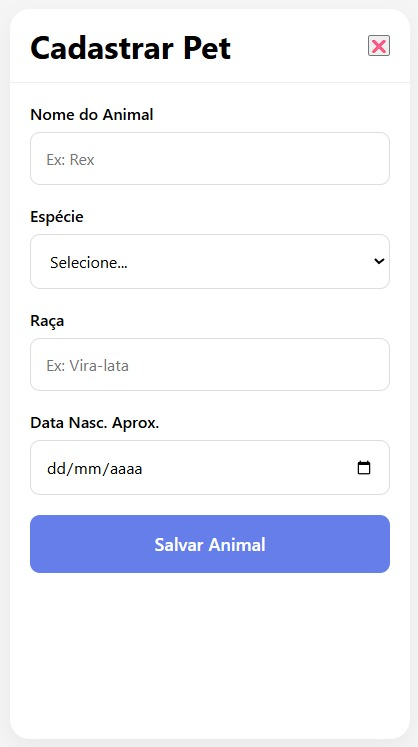
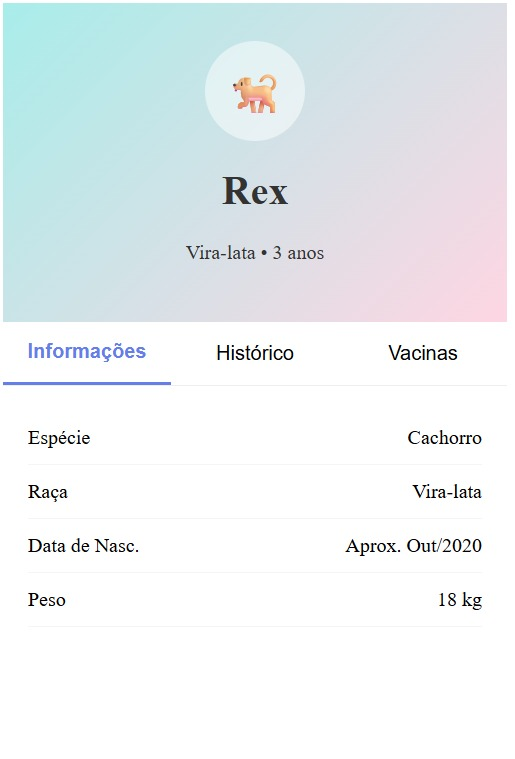

# Arquitetura do Sistema - Gestão-Pet

Última atualização: 01/12/2025

## 1. Descrição da Arquitetura
O sistema **Gestão-Pet** é uma aplicação multiplataforma (**Web + Mobile**) desenvolvida inteiramente em **React Native com Expo**, utilizando o recurso de **compilação para Web (React Native Web)**.
O backend utiliza o **Back4App (Parse Server)** no modelo de **Backend-as-a-Service (BaaS)**.

A arquitetura foi projetada para:
- Código unificado entre Web e Mobile
- Escalabilidade
- Desenvolvimento rápido
- Segurança com **CLPs, ACLs e Cloud Code**
- Integração direta via **Parse SDK**

## 2. Diagrama de Arquitetura


## 3. Componentes do Sistema

### 3.1. Frontend Universal (Web + Mobile)
**Tecnologias:** React Native, Expo, React Native Web, expo-router, Parse SDK: parse/react-native.js, AsyncStorage
A mesma base de código gera: Aplicativo Mobile (Android / iOS), aplicação web

**Responsabilidades:** 
Autenticação de usuários
Cadastro e listagem de animais
Registro de atendimentos
Pesquisa de tutores e pets
Cache local de sessão
Navegação entre telas
Comunicação com o Parse

**Estrutura de Pastas:**
```text
app/
├── _layout.jsx                 # Layout global da aplicação (Stack/Navigation)
├── index.jsx                   # Tela inicial (Home do app)
│
├── signup/                     # Fluxo de cadastro de usuário
│   └── index.jsx               # Tela de cadastro
│
├── tutor/                      # Fluxo do Tutor (dono do animal)
│   ├── index.jsx               # Lista de animais do tutor
│   ├── animal-details.jsx     # Detalhes do animal + histórico
│   └── register-animal.jsx    # Cadastro de novo animal
│
├── employee/                   # Fluxo do Funcionário / Servidor
│   ├── index.jsx               # Tela principal do funcionário
│   └── register-appointment.jsx # Registro de atendimento/consulta
```

### 3.2. Backend (Back4App)
**Plataforma:** Back4App (Parse Server)

| Serviço        | Tipo                  | Descrição |
|----------------|-----------------------|-----------|
| API REST       | Parse REST API        | Endpoints para todas as operações |
| Autenticação   | Parse Authentication  | Login, logout, gestão de sessões |
| Banco de Dados | PostgreSQL            | Armazenamento relacional |
| Armazenamento  | Parse Files           | Upload e gestão de arquivos |
| Cloud Functions | Cloud Code           | Lógica de negócio personalizada |

**Classes Principais no Back4App:**
```javascript
// User (usuário do sistema)
const User = {
  username: String,    // email
  password: String,    // hash
  email: String,
  role: String,       // 'tutor' ou 'servidor'
  nome: String,
  data_criacao: Date,
  ultimo_login: Date,
  ativo: Boolean
};

// Animal (dados dos pets)
const Animal = {
  nome: String,
  especie: String,
  raca: String,
  data_nascimento: Date,
  tutor: Pointer <Tutor>,
  atendimentos: Relation <Atendimento>,
  observacoes: String,
  data_criacao: Date,
  ativo: Boolean
};

// Atendimento (consulta realizada)
const Atendimento = {
  animal: Pointer<Animal>,
  funcionario: Pointer<Funcionario>,
  data_consulta: Date,
  procedimentos: String,
  vacinas: Relation<Vacina>,
  observacoes: String,
  relatorio: String,
  data: Date
};

// Dados do servidor público
const Funcionario = {
  usuario: Pointer<_User>,
  senha: String,
  nome: String,
  email: String
};

// Dados do tutor
const Tutor = {
  usuario: Pointer<_User>,
  senha: String,
  nome: String,
  email: String
};

// Dados do banco de vacinas pré-estabelecidas
const Vacina = {
  nome: String
}

```

## 4. Padrões Arquiteturais Utilizados
### 4.1. Client-Server Pattern
**Aplicação:** Separação entre frontend e backend  
**Benefícios:** Escalabilidade independente, desenvolvimento paralelo  
**Implementação:** Frontend React Native consome APIs REST do Back4App  

### 4.2. MVC (Model-View-Controller)
Aplicação: Organização do código frontend  

- **Model:** Serviços API e Context API  
- **View:** Componentes React  
- **Controller:** Hooks e handlers de eventos  

### 4.3. Repository Pattern
**Aplicação:** Abstração da camada de dados  
**Implementação:** Serviços API encapsulam chamadas ao Back4App  

```javascript
// Exemplo consulta ao banco
  Parse.Cloud.beforeSave("Atendimento", (request) => {
    const user = request.user;

    if (!user || user.get("role") !== "servidor") {
      throw "Apenas servidores podem registrar consultas.";
    }
  });
```

### 4.4. Component-Based Architecture
**Aplicação:** Desenvolvimento frontend  
**Benefícios:** Reutilização, manutenibilidade, teste isolado  
**Implementação:** Componentes React funcionais com hooks  

## 5. Fluxo de Dados
### 5.1. Autenticação e Autorização


### 5.2. Registro de Consulta (Servidor)


### 5.3. Acesso ao Histórico (Tutor)


## 6. Decisões Técnicas e Justificativas
### 6.1. Escolha do Back4App (BaaS)
- Velocidade de desenvolvimento  
- Custo reduzido  
- Recursos built-in  
- Escalabilidade  
- Manutenção gerenciada  

### 6.2. React Native como Frontend Universal (Web + Mobile)

Todo o frontend do sistema foi desenvolvido utilizando **React Native com Expo**, permitindo que a **mesma base de código** seja utilizada tanto para **aplicação Web (React Native Web)** quanto para **aplicações Mobile (Android e iOS)**.

Essa decisão elimina a separação entre “React Web” e “React Native Mobile”, simplificando a arquitetura do projeto.

**Justificativas:**
- Código único para Web e Mobile  
- Redução de retrabalho e duplicação de lógica  
- Produtividade no desenvolvimento  
- Navegação unificada com `expo-router`  
- Integração direta com o Parse SDK  
- Manutenção centralizada  
- Atualizações simultâneas em todas as plataformas  
- Performance suficiente para aplicações de gestão  
- Facilidade de publicação (web, Android e iOS)

### 6.4. Arquitetura de Estado (Context API)
- Simplicidade  
- Integração nativa  
- Complexidade adequada  
- Performance suficiente  

### 6.5. Estratégia de Autenticação
- JWT stateless  
- Segurança com tokens assinados  
- Escalabilidade distribuída  
- Mobile-friendly  

## 7. Interface do Usuário
### 7.1. Fluxo do Tutor
**Login/Cadastro → Lista de Pets → Detalhes do Animal → Histórico de Consultas**  

### 7.2. Fluxo do Servidor
**Login/Cadastro → Busca por tutores → Lista de animais do tutor → Detalhes do Animal → Histórico de Consultas**  

### 7.3. Design System
- Azul (#667eea) para ações primárias  
- Tipografia sans-serif  
- Cards, botões hierarquizados  

## 8. Protótipos e Design
Protótipos disponíveis em `../prototypes/`.  

### 8.1. Protótipos Web
- 
- 
- 
- 
- 
- 
- 

### 8.2. Protótipos Mobile
- 
- 
- 
- 
- 
- 
- 

## 9. Considerações de Segurança
### 9.1. Proteção de Dados
- HTTPS em todas as comunicações  
- Autenticação JWT com expiração curta  
- Sanitização de dados frontend/backend  
- CORS restritivo  

### 9.2. Proteção de Dados Sensíveis
- **Senhas** com hash bcrypt  
- **Dados pessoais** protegidos pela LGPD  
- **Histórico médico** com acesso restrito  

## 10. Estratégia de Testes
### 10.1. Frontend Web
- **Unit Tests:** Jest + React Testing Library
- **Component Tests:** Renderização e interações
- **Integration Tests:** Fluxos completos de usuário
- **E2E Tests:** Cypress para testes ponta a ponta

### 10.2. Frontend Mobile
- **Unit Tests:** Jest  
- **Component Tests:** React Native Testing Library  
- **Device Testing:** TestFlight e Play Store  

### 10.3. Backend
- **API Tests:** Supertest para endpoints REST
- **Integration Tests:** Validação de regras de negócio
- **Security Tests:** Validação de autenticação e autorização  
