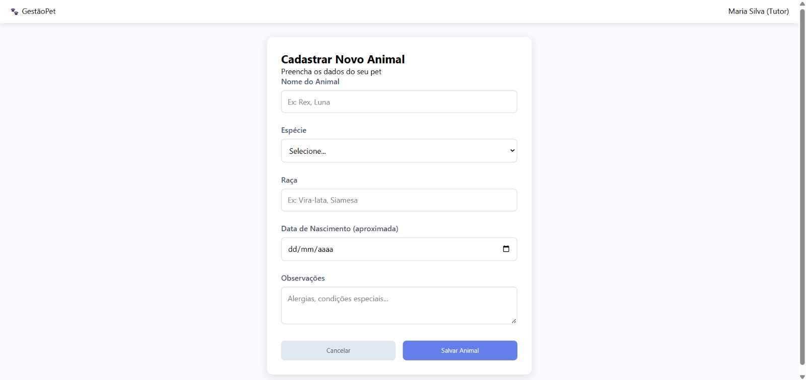
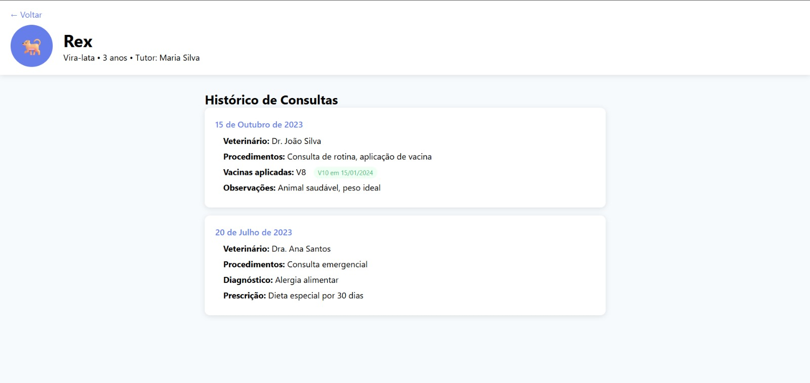
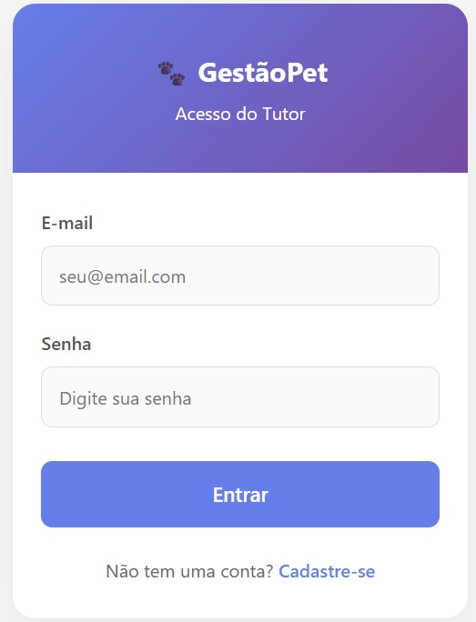
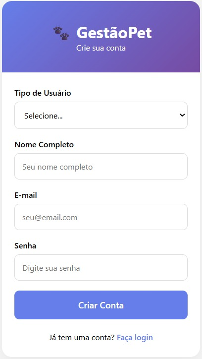

# Arquitetura do Sistema - Gestão-Pet
## 1. Descrição da Arquitetura
O sistema Gestão-Pet adota uma arquitetura **cliente-servidor com backend como serviço (BaaS)**, projetada para oferecer escalabilidade, manutenibilidade e experiência multiplataforma consistente. A arquitetura é composta por três camadas principais: frontend web, frontend mobile e backend em nuvem.

## 2. Diagrama de Arquitetura


## 3. Componentes do Sistema

### 3.1. Frontend Web
**Tecnologias:** React.js, HTML5, CSS3, JavaScript (ES6+)

| Componente          | Tecnologia            | Responsabilidade                        |
|---------------------|----------------------|-----------------------------------------|
| Interface do Usuário | React.js + Components | Renderização das telas e componentes |
| Roteamento          | React Router          | Navegação entre páginas |
| Gerenciamento de Estado | React Context API | Estado global da aplicação |
| Chamadas HTTP       | Axios                 | Comunicação com a API Back4App |
| Estilização         | CSS Modules + Flexbox/Grid | Layout responsivo e consistente |

**Estrutura de Pastas:**
```text
src/
├── components/          # Componentes reutilizáveis
│   ├── common/         # Botões, inputs, modais
│   ├── forms/          # Formulários de cadastro
│   └── layout/         # Header, footer, sidebar
├── pages/              # Páginas da aplicação
│   ├── auth/           # Login e cadastro
│   ├── tutor/          # Telas do tutor
│   └── servidor/       # Telas do servidor
├── services/           # Integração com APIs
│   ├── api.js         # Configuração do Back4App
│   └── auth.js        # Serviços de autenticação
├── contexts/           # Gerenciamento de estado
│   ├── AuthContext.js
│   └── AppContext.js
└── utils/              # Utilitários e helpers
```

### 3.2. Frontend Mobile
**Tecnologias:** React Native, Expo (opcional), iOS Swift (alternativa)

| Componente          | Tecnologia            | Responsabilidade                        |
|---------------------|----------------------|-----------------------------------------|
| Interface Nativa    | React Native Components | UI adaptada para mobile |
| Navegação           | React Navigation       | Stack e tab navigation |
| Armazenamento Local | AsyncStorage          | Cache de dados offline |
| Notificações        | Push Notifications    | Alertas e lembretes |
| Integração API      | Axios/Fetch           | Comunicação com backend |

**Estrutura de Telas Mobile:**
```text
screens/
├── auth/
│   ├── LoginScreen.js
│   └── RegisterScreen.js
├── tutor/
│   ├── PetsListScreen.js
│   ├── PetDetailScreen.js
│   └── AddPetScreen.js
├── servidor/
│   ├── SearchScreen.js
│   └── ConsultationScreen.js
└── shared/
    ├── ProfileScreen.js
    └── SettingsScreen.js
```

### 3.3. Backend (Back4App)
**Plataforma:** Back4App (Parse Server)

| Serviço        | Tipo                  | Descrição |
|----------------|-----------------------|-----------|
| API REST       | Parse REST API        | Endpoints para todas as operações |
| Autenticação   | Parse Authentication  | Login, logout, gestão de sessões |
| Banco de Dados | PostgreSQL            | Armazenamento relacional |
| Armazenamento  | Parse Files           | Upload e gestão de arquivos |
| Cloud Functions | Cloud Code           | Lógica de negócio personalizada |

**Classes Principais no Back4App:**
```javascript
// User (usuário do sistema)
const User = {
  username: String,    // email
  password: String,    // hash
  email: String,
  tipo: String,       // 'tutor' ou 'servidor'
  nome: String,
  data_criacao: Date,
  ultimo_login: Date,
  ativo: Boolean
};

// Animal (dados dos pets)
const Animal = {
  usuario: Pointer<User>,
  nome: String,
  especie: String,    // 'cao' ou 'gato'
  raca: String,
  data_nascimento: Date,
  peso: Number,
  comorbidades: String,
  observacoes: String,
  data_criacao: Date,
  ativo: Boolean
};

// Consulta (histórico veterinário)
const Consulta = {
  animal: Pointer<Animal>,
  usuario: Pointer<User>, // servidor que registrou
  data_consulta: Date,
  procedimentos: String,
  vacinas_aplicadas: String,
  observacoes: String,
  prescricao: String,
  data_registro: Date
};
```

## 4. Padrões Arquiteturais Utilizados
### 4.1. Client-Server Pattern
**Aplicação:** Separação entre frontend e backend  
**Benefícios:** Escalabilidade independente, desenvolvimento paralelo  
**Implementação:** Frontend React consome APIs REST do Back4App  

### 4.2. MVC (Model-View-Controller)
Aplicação: Organização do código frontend  

- **Model:** Serviços API e Context API  
- **View:** Componentes React  
- **Controller:** Hooks e handlers de eventos  

### 4.3. Repository Pattern
**Aplicação:** Abstração da camada de dados  
**Implementação:** Serviços API encapsulam chamadas ao Back4App  

```javascript
// Exemplo: AnimalRepository
class AnimalService {
  static async getAnimalsByUser(userId) {
    return await Back4AppAPI.get(`/classes/Animal?where={"usuario":"${userId}"}`);
  }
  
  static async createAnimal(animalData) {
    return await Back4AppAPI.post('/classes/Animal', animalData);
  }
}
```

### 4.4. Component-Based Architecture
**Aplicação:** Desenvolvimento frontend  
**Benefícios:** Reutilização, manutenibilidade, teste isolado  
**Implementação:** Componentes React funcionais com hooks  

## 5. Fluxo de Dados
### 5.1. Autenticação e Autorização


### 5.2. Registro de Consulta (Servidor)


### 5.3. Acesso ao Histórico (Tutor)


## 6. Decisões Técnicas e Justificativas
### 6.1. Escolha do Back4App (BaaS)
- Velocidade de desenvolvimento  
- Custo reduzido  
- Recursos built-in  
- Escalabilidade  
- Manutenção gerenciada  

### 6.2. React.js para Frontend Web
- Curva de aprendizado favorável  
- Ecossistema robusto  
- Reutilização com React Native  
- Performance (Virtual DOM)  
- Flexibilidade  

### 6.3. React Native para Mobile
- Código compartilhado (~70%)  
- Produtividade  
- Manutenção centralizada  
- Performance suficiente  
- Alternativa nativa (Swift, se necessário)  

### 6.4. Arquitetura de Estado (Context API)
- Simplicidade  
- Integração nativa  
- Complexidade adequada  
- Performance suficiente  

### 6.5. Estratégia de Autenticação
- JWT stateless  
- Segurança com tokens assinados  
- Escalabilidade distribuída  
- Mobile-friendly  

## 7. Interface do Usuário
### 7.1. Fluxo do Tutor
**Login/Cadastro → Lista de Pets → Detalhes do Animal → Histórico de Consultas**  

### 7.2. Fluxo do Servidor
**Login → Pesquisa de Animal → Registro de Consulta**  

### 7.3. Design System
- Azul (#667eea) para ações primárias  
- Tipografia sans-serif  
- Cards, botões hierarquizados  
- Abas no mobile, menu lateral no web  

## 8. Protótipos e Design
Protótipos disponíveis em `../prototypes/`.  

### 8.1. Protótipos Web
- 
- 
- 
- 
- 
- 
- 

### 8.2. Protótipos Mobile
- 
- 
- 
- 
- 
- 
- 

## 9. Considerações de Segurança
### 9.1. Proteção de Dados
- HTTPS em todas as comunicações  
- Autenticação JWT com expiração curta  
- Sanitização de dados frontend/backend  
- CORS restritivo  

### 9.2. Controle de Acesso
```javascript
// Back4App Cloud Code - Validação de permissões
Parse.Cloud.beforeSave("Consulta", (request) => {
  const user = request.user;
  const consulta = request.object;
  
  if (!user || user.get("tipo") !== "servidor") {
    throw "Apenas servidores podem registrar consultas";
  }
});
```

### 9.3. Proteção de Dados Sensíveis
- **Senhas** com hash bcrypt  
- **Dados pessoais** protegidos pela LGPD  
- **Histórico médico** com acesso restrito  

## 10. Estratégia de Testes
### 10.1. Frontend Web
- **Unit Tests:** Jest + React Testing Library
- **Component Tests:** Renderização e interações
- **Integration Tests:** Fluxos completos de usuário
- **E2E Tests:** Cypress para testes ponta a ponta

### 10.2. Frontend Mobile
- **Unit Tests:** Jest  
- **Component Tests:** React Native Testing Library  
- **Device Testing:** TestFlight e Play Store  

### 10.3. Backend
- **API Tests:** Supertest para endpoints REST
- **Integration Tests:** Validação de regras de negócio
- **Security Tests:** Validação de autenticação e autorização  
