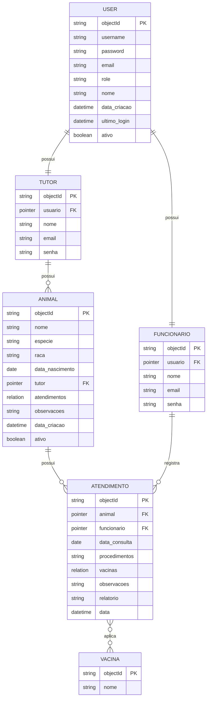

# Modelo de Dados - Gestão-Pet

Última atualização: 01/12/2025

## 1. Visão Geral do Banco de Dados

O banco de dados do sistema **Gestão-Pet** foi projetado utilizando o modelo orientado a objetos do **Parse Server (Back4App)**, baseado em **classes, ponteiros (Pointer) e relacionamentos (Relation)**.

O objetivo é garantir:
- Integridade dos dados
- Segurança por perfil de usuário
- Facilidade de escalabilidade
- Separação clara de responsabilidades entre Tutor e Funcionário

---

## 2. Diagrama Entidade-Relacionamento (Lógico)


## 3. Descrição das Entidades
### 3.1. Entidade: USUARIO
Armazena os dados principais de autenticação do sistema.

| Campo        | Tipo    | Obrigatório | Descrição             |
| ------------ | ------- | ----------- | --------------------- |
| objectId     | String  | Sim         | Identificador único   |
| username     | String  | Sim         | Email usado no login  |
| password     | String  | Sim         | Hash da senha         |
| email        | String  | Sim         | Email do usuário      |
| role         | String  | Sim         | `tutor` ou `servidor` |
| nome         | String  | Sim         | Nome completo         |
| data_criacao | Date    | Sim         | Data de criação       |
| ultimo_login | Date    | Não         | Último acesso         |
| ativo        | Boolean | Sim         | Status da conta       |

### 3.2. Entidade: Tutor

| Campo    | Tipo          | Obrigatório | Descrição             |
| -------- | ------------- | ----------- | --------------------- |
| objectId | String        | Sim         | Identificador         |
| usuario  | Pointer<User> | Sim         | Referência ao usuário |
| nome     | String        | Sim         | Nome do tutor         |
| email    | String        | Sim         | Email                 |
| senha    | String        | Sim         | Senha                 |

### 3.3. Entidade: Funcionario

| Campo    | Tipo          | Obrigatório | Descrição             |
| -------- | ------------- | ----------- | --------------------- |
| objectId | String        | Sim         | Identificador         |
| usuario  | Pointer<User> | Sim         | Referência ao usuário |
| nome     | String        | Sim         | Nome do funcionário   |
| email    | String        | Sim         | Email                 |
| senha    | String        | Sim         | Senha                 |

### 3.4. Entidade: Animal

| Campo           | Tipo                  | Obrigatório | Descrição            |
| --------------- | --------------------- | ----------- | -------------------- |
| objectId        | String                | Sim         | Identificador        |
| nome            | String                | Sim         | Nome do animal       |
| especie         | String                | Sim         | `cao` ou `gato`      |
| raca            | String                | Não         | Raça                 |
| data_nascimento | Date                  | Não         | Data de nascimento   |
| tutor           | Pointer<Tutor>        | Sim         | Tutor dono do animal |
| atendimentos    | Relation<Atendimento> | Não         | Histórico            |
| observacoes     | String                | Não         | Observações          |
| data_criacao    | Date                  | Sim         | Data de cadastro     |
| ativo           | Boolean               | Sim         | Status               |

### 3.5 Entidade: Atendimento
| Campo         | Tipo                 | Obrigatório | Descrição                |
| ------------- | -------------------- | ----------- | ------------------------ |
| objectId      | String               | Sim         | Identificador            |
| animal        | Pointer<Animal>      | Sim         | Animal atendido          |
| funcionario   | Pointer<Funcionario> | Sim         | Servidor responsável     |
| data_consulta | Date                 | Sim         | Data da consulta         |
| procedimentos | String               | Sim         | Procedimentos realizados |
| vacinas       | Relation<Vacina>     | Não         | Vacinas aplicadas        |
| observacoes   | String               | Não         | Observações              |
| relatorio     | String               | Não         | Relatório clínico        |
| data          | Date                 | Sim         | Data de registro         |

### 3.6. Entidade: Vacina

| Campo    | Tipo   | Obrigatório | Descrição      |
| -------- | ------ | ----------- | -------------- |
| objectId | String | Sim         | Identificador  |
| nome     | String | Sim         | Nome da vacina |


## 4. Relacionamentos
### 4.1. User → Tutor (1:1)
Cada tutor possui exatamente um usuário

### 4.2. User → Funcionario (1:1)
Cada funcionário possui exatamente um usuário

### 4.3. Tutor → Animal (1:N)
Um tutor pode possuir vários animais
Um animal pertence a exatamente um tutor

### 4.4. Animal → Atendimento (1:N)
Um animal pode ter vários atendimentos
Um atendimento pertence a um animal

### 4.5. Funcionario → Atendimento (1:N)
Um funcionário pode registrar vários atendimentos

### 4.6. Atendimento → Vacina (N:N)
Um atendimento pode conter várias vacinas
Uma vacina pode aparecer em vários atendimentos

## 5. Dicionário de Dados

### 5.1. User.role

| Valor    | Significado            |
| -------- | ---------------------- |
| tutor    | Dono do animal         |
| servidor | Funcionário do sistema |


### 5.2. ANIMAL.especie

| Valor | Significado |
| ----- | ----------- |
| cao   | Cão         |
| gato  | Gato        |


## 6. Regras de Negócio
### Apenas servidores podem registrar atendimentos
### Tutores só podem visualizar seus próprios animais
### Tutores só podem visualizar os atendimentos dos seus animais
### Vacinas só podem ser vinculadas a atendimentos

## 7. Segurança e Controle de Acesso (CLPs + ACLs)

| Classe      | Leitura                 | Escrita                 |
| ----------- | ----------------------- | ----------------------- |
| User        | Próprio usuário         | Próprio usuário         |
| Tutor       | Próprio tutor           | Próprio tutor           |
| Funcionario | Servidores              | Sistema                 |
| Animal      | Tutor dono + Servidores | Tutor dono + Servidores |
| Atendimento | Tutor dono + Servidores | Apenas Servidores       |
| Vacina      | Servidores              | Servidores              |

## 8. Modelo Físico - Back4App
### 8.1. Classes Equivalentes no Back4App
```bash
User
- username (String)
- password (String)
- email (String)
- role (String)
- nome (String)
- data_criacao (Date)
- ultimo_login (Date)
- ativo (Boolean)

Tutor
- usuario (Pointer to User)
- nome (String)
- email (String)
- senha (String)

Funcionario
- usuario (Pointer to User)
- nome (String)
- email (String)
- senha (String)

Animal
- nome (String)
- especie (String)
- raca (String)
- data_nascimento (Date)
- tutor (Pointer to Tutor)
- atendimentos (Relation to Atendimento)
- observacoes (String)
- data_criacao (Date)
- ativo (Boolean)

Atendimento
- animal (Pointer to Animal)
- funcionario (Pointer to Funcionario)
- data_consulta (Date)
- procedimentos (String)
- vacinas (Relation to Vacina)
- observacoes (String)
- relatorio (String)
- data (Date)

Vacina
- nome (String)
```

### 8.2. Configuração de Permissões no Back4App
- **User:** Leitura pública, escrita apenas pelo próprio usuário
- **Animal:** Leitura pelo tutor e servidores, escrita pelo tutor
- **Atendimento:** Leitura pelo tutor e servidores, escrita apenas por servidores
