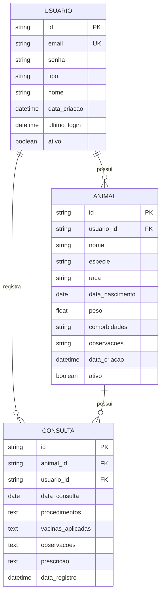

# Modelo de Dados - Gestão-Pet
## 1. Visão Geral do Banco de Dados
O banco de dados do sistema Gestão-Pet foi projetado para armazenar informações de usuários, animais e consultas veterinárias, seguindo uma arquitetura relacional com ênfase na segurança e integridade dos dados.

## 2. Diagrama Entidade-Relacionamento

## 3. Descrição das Entidades
### 3.1. Entidade: USUARIO
Armazena informações de todos os usuários do sistema (tutores e servidores públicos).

| Campo | Tipo | Obrigatório | Descrição | Restrições |
|-------|------|-------------|-----------|------------|
| id | VARCHAR(36) | Sim | Identificador único do usuário | Primary Key, UUID |
| email | VARCHAR(255) | Sim | E-mail do usuário | Unique, Formato válido |
| senha | VARCHAR(255) | Sim | Hash da senha do usuário | Mínimo 8 caracteres |
| tipo | ENUM('tutor','servidor') | Sim | Tipo de usuário | Valores fixos |
| nome | VARCHAR(255) | Sim | Nome completo do usuário | - |
| data_criacao | DATETIME | Sim | Data de criação do registro | Auto-generated |
| ultimo_login | DATETIME | Não | Data do último acesso | - |
| ativo | BOOLEAN | Sim | Status da conta | Default: true |
**Exemplo de dados:**

```sql
INSERT INTO USUARIO (id, email, senha, tipo, nome, data_criacao, ativo) 
VALUES ('uuid-1234', 'maria.silva@email.com', 'hash_senha', 'tutor', 'Maria Silva', NOW(), true);
```
### 3.2. Entidade: ANIMAL
Armazena informações dos animais cadastrados no sistema.

| Campo | Tipo | Obrigatório | Descrição | Restrições |
|-------|------|-------------|-----------|------------|
| id | VARCHAR(36) | Sim | Identificador único do animal | Primary Key, UUID |
| usuario_id | VARCHAR(36) | Sim | ID do tutor do animal | Foreign Key (USUARIO.id) |
| nome | VARCHAR(100) | Sim | Nome do animal | - |
| especie | ENUM('cao','gato') | Sim | Espécie do animal | Valores fixos |
| raca | VARCHAR(100) | Não | Raça do animal | - |
| data_nascimento | DATE | Não | Data de nascimento aproximada | - |
| peso | FLOAT | Não | Peso atual em kg | >= 0 |
| comorbidades | TEXT | Não | Condições de saúde conhecidas | - |
| observacoes | TEXT | Não | Observações gerais | - |
| data_criacao | DATETIME | Sim | Data de criação do registro | Auto-generated |
| ativo | BOOLEAN | Sim | Status do registro | Default: true |

**Exemplo de dados:**
```sql
INSERT INTO ANIMAL (id, usuario_id, nome, especie, raca, data_nascimento, peso, data_criacao, ativo)
VALUES ('uuid-5678', 'uuid-1234', 'Rex', 'cao', 'Vira-lata', '2020-06-15', 18.5, NOW(), true);
```
### 3.3. Entidade: CONSULTA
Registra o histórico de consultas e procedimentos veterinários realizados.

| Campo | Tipo | Obrigatório | Descrição | Restrições |
|-------|------|-------------|-----------|------------|
| id | VARCHAR(36) | Sim | Identificador único da consulta | Primary Key, UUID |
| animal_id | VARCHAR(36) | Sim | ID do animal atendido | Foreign Key (ANIMAL.id) |
| usuario_id | VARCHAR(36) | Sim | ID do servidor que registrou | Foreign Key (USUARIO.id) |
| data_consulta | DATE | Sim | Data em que a consulta ocorreu | <= data_registro |
| procedimentos | TEXT | Sim | Procedimentos realizados | - |
| vacinas_aplicadas | TEXT | Não | Vacinas aplicadas na consulta | - |
| observacoes | TEXT | Não | Observações do veterinário | - |
| prescricao | TEXT | Não | Medicações ou tratamentos prescritos | - |
| data_registro | DATETIME | Sim | Data do registro no sistema | Auto-generated |

**Exemplo de dados:**

```sql
INSERT INTO CONSULTA (id, animal_id, usuario_id, data_consulta, procedimentos, vacinas_aplicadas, observacoes, data_registro)
VALUES ('uuid-9012', 'uuid-5678', 'uuid-3456', '2023-10-15', 'Consulta de rotina, limpeza de ouvidos', 'V8', 'Animal saudável, peso ideal', NOW());
```
## 4. Relacionamentos
### 4.1. USUARIO → ANIMAL (1:N)
- Um usuário do tipo tutor pode possuir múltiplos animais
- Um animal pertence a exatamente um tutor
- Quando um tutor é desativado, seus animais também são marcados como inativos
- **Cardinalidade:** 1 usuário para N animais

### 4.2. USUARIO → CONSULTA (1:N)
- Um usuário do tipo servidor pode registrar múltiplas consultas
- Cada consulta é registrada por exatamente um servidor
- Cardinalidade: 1 servidor para N consultas
### 4.3. ANIMAL → CONSULTA (1:N)
- Um animal pode ter múltiplas consultas registradas
- Cada consulta refere-se a exatamente um animal
- Cardinalidade: 1 animal para N consultas
## 5. Dicionário de Dados
### 5.1. Tabela USUARIO

| Campo | Descrição Detalhada | Exemplo | Regras de Negócio |
|-------|---------------------|---------|-------------------|
| tipo | Define o perfil de acesso | 'tutor' ou 'servidor' | Tutores só veem seus animais; servidores veem todos |
| email | Login do usuário | 'usuario@email.com' | Único no sistema, usado para login |
| senha | Credencial de acesso | 'hash_bcrypt' | Armazenada com hash bcrypt, mínimo 8 caracteres |
| ativo | Status da conta | true/false | Contas inativas não podem fazer login |

### 5.2. Tabela ANIMAL

| Campo | Descrição Detalhada | Exemplo | Regras de Negócio |
|-------|---------------------|---------|-------------------|
| especie | Classificação do animal | 'cao' ou 'gato' | Determina tratamentos e vacinas específicas |
| data_nascimento | Idade do animal | '2020-06-15' | Usada para calcular idade em consultas |
| peso | Controle de saúde | 18.5 | Atualizado a cada consulta, usado para dosagem |

### 5.3. Tabela CONSULTA

| Campo | Descrição Detalhada | Exemplo | Regras de Negócio |
|-------|---------------------|---------|-------------------|
| data_consulta | Quando ocorreu o atendimento | '2023-10-15' | Não pode ser futura à data de registro |
| procedimentos | O que foi realizado | 'Aplicação de vacina V8' | Campo obrigatório para histórico |
| vacinas_aplicadas | Controle de imunização | 'V8, Raiva' | Usado para calcular próximas vacinas |

## 6. Índices e Otimizações
### 6.1. Índices Principais
```sql
-- Índices para otimização de consultas frequentes
CREATE INDEX idx_usuario_tipo ON USUARIO(tipo);
CREATE INDEX idx_animal_usuario_id ON ANIMAL(usuario_id);
CREATE INDEX idx_consulta_animal_id ON CONSULTA(animal_id);
CREATE INDEX idx_consulta_data ON CONSULTA(data_consulta);
CREATE INDEX idx_usuario_email ON USUARIO(email);
```
### 6.2. Consultas Otimizadas
**Consulta de animais por tutor:**

```sql
SELECT * FROM ANIMAL 
WHERE usuario_id = ? AND ativo = true 
ORDER BY nome;
```
**Histórico de consultas por animal:**
```sql
SELECT c.*, u.nome as servidor_nome 
FROM CONSULTA c 
JOIN USUARIO u ON c.usuario_id = u.id 
WHERE c.animal_id = ? 
ORDER BY c.data_consulta DESC;
```
## 7. Regras de Integridade
### 7.1. Constraints de Integridade Referencial
- `ANIMAL.usuario_id` referencia `USUARIO.id` (CASCADE on DELETE)
- `CONSULTA.animal_id` referencia `ANIMAL.id` (RESTRICT on DELETE)
- `CONSULTA.usuario_id` referencia `USUARIO.id` (RESTRICT on DELETE)

### 7.2. Validações de Dados
- Email deve ter formato válido
- Data de nascimento do animal não pode ser futura
- Data de consulta não pode ser futura à data de registro
- Peso do animal deve ser maior que zero

### 7.3. Triggers Recomendados
```sql
-- Impedir exclusão de animais com consultas registradas
CREATE TRIGGER prevent_animal_delete 
BEFORE DELETE ON ANIMAL 
FOR EACH ROW 
BEGIN
    IF EXISTS (SELECT 1 FROM CONSULTA WHERE animal_id = OLD.id) THEN
        SIGNAL SQLSTATE '45000' SET MESSAGE_TEXT = 'Não é possível excluir animal com histórico de consultas';
    END IF;
END;

-- Atualizar data de último login
CREATE TRIGGER update_last_login 
AFTER UPDATE ON USUARIO 
FOR EACH ROW 
BEGIN
    IF NEW.ultimo_login IS NULL OR NEW.ultimo_login < OLD.ultimo_login THEN
        SET NEW.ultimo_login = NOW();
    END IF;
END;
```

## 8. Considerações de Segurança
### 8.1. Dados Sensíveis
- Senhas: armazenadas com hash bcrypt
- E-mails: considerados dados pessoais, protegidos por LGPD
- Histórico médico: acesso restrito por perfil de usuário

### 8.2. Permissões de Acesso
- **Tutores:** SELECT em seus próprios animais e consultas
- **Servidores:** SELECT em todos os animais, INSERT em consultas
- **Administradores:** Acesso completo (não implementado na versão atual)

## 9. Modelo Físico - Back4App
### 9.1. Classes Equivalentes no Back4App
```bash
User (Back4App)
- username (email)
- password
- email
- tipo (String)
- nome (String)
- data_criacao (Date)
- ultimo_login (Date)
- ativo (Boolean)

Animal (Back4App)
- usuario (Pointer to User)
- nome (String)
- especie (String)
- raca (String)
- data_nascimento (Date)
- peso (Number)
- comorbidades (String)
- observacoes (String)
- data_criacao (Date)
- ativo (Boolean)

Consulta (Back4App)
- animal (Pointer to Animal)
- usuario (Pointer to User)
- data_consulta (Date)
- procedimentos (String)
- vacinas_aplicadas (String)
- observacoes (String)
- prescricao (String)
- data_registro (Date)
```

### 9.2. Configuração de Permissões no Back4App
- **User:** Leitura pública, escrita apenas pelo próprio usuário
- **Animal:** Leitura pelo tutor e servidores, escrita pelo tutor e servidores
- **Consulta:** Leitura pelo tutor e servidores, escrita apenas por servidores
